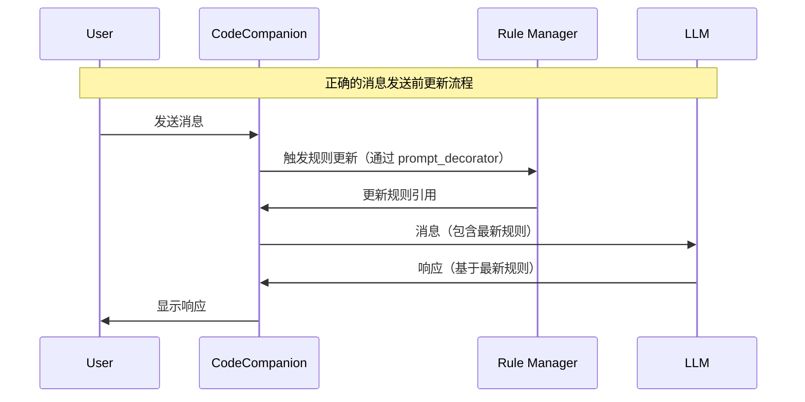

# codecompanion-tools.nvim

A comprehensive collection of advanced tools and extensions for [CodeCompanion.nvim](https://github.com/olimorris/codecompanion.nvim), designed to enhance your AI-powered coding workflow with intelligent automation and productivity features.

## 🌟 Overview

This extension provides a suite of sophisticated tools that seamlessly integrate with CodeCompanion through a modern adapter architecture:

- **Intelligent Rule Management**: Automatically discover and apply project-specific AI rules with pre-submit updates
- **Flexible Model Switching**: Quick and easy switching between different LLM models with per-buffer memory
- **Advanced DAG Task Management**: Complex workflow orchestration with dependency resolution and parallel execution
- **Smart Context Compression**: Intelligent chat context optimization with automatic triggers and quality preservation

All tools are designed to work automatically in the background while providing manual control when needed, utilizing a clean modular adapter system for optimal performance and maintainability.

## 🚀 Features

### 📋 Complete Feature Set

Here's what codecompanion-tools.nvim brings to your development workflow:

### Rule Manager

Automatically detects and manages rule files for your project context in CodeCompanion chat buffers with sophisticated timing and caching.

- **Pre-Submit Rule Updates**: Updates rule references **before** messages are sent to the LLM using CodeCompanion's `prompt_decorator` system
- **Automatic Rule Detection**: Automatically finds and includes relevant rule files (`.rules`, `.cursorrules`, `AGENT.md`, etc.) in your chat context
- **Smart Context Management**: Only includes rules from directories containing files referenced in your chat
- **Multiple Rule File Support**: Supports 10+ common rule file formats used by different AI tools
- **Intelligent Caching**: Fingerprint-based caching system to avoid redundant processing
- **Sophisticated Path Extraction**: Extracts file paths from chat references, slash commands, and tool outputs with customizable extraction functions

### Model Toggle

Quickly switch between LLM models in any CodeCompanion chat buffer.

- **Two Switching Modes**: 
  - **Sequence Mode**: Cycle through a predefined sequence of adapter+model combinations
  - **Models Mode**: Cycle through models within the same adapter
- **Per-Buffer Memory**: Each chat buffer remembers its original model independently
- **Customizable Keymaps**: Default keymap is `<S-Tab>` but fully customizable
- **Instant Notifications**: Shows which model you've switched to

### DAG Checklist System

Create and manage complex task checklists with dependency management and parallel execution through a unified `checklist` tool.

- **Dependency Management**: Define task dependencies with cycle detection to ensure proper execution order
- **Parallel Execution**: Automatically execute independent read-only tasks in parallel for efficiency
- **Task Status Tracking**: Track task progress with states (pending, in_progress, completed, blocked)
- **Access Mode Control**: Specify task access modes (read, write, readwrite) for safe parallel execution
- **Persistent Storage**: JSON-based storage in vim data directory with automatic save/restore across sessions
- **Progress Monitoring**: Visual progress tracking with completion statistics and rich output formatting
- **Action-Based Interface**: Simple actions (create, list, status, complete) for intuitive task management

### Context Compression System

Intelligent context compression to optimize chat performance and manage memory usage with sophisticated quality assessment.

- **Smart Compression**: Automatically compresses chat context when thresholds are exceeded
- **Multiple Strategies**: Simple truncation, structured summarization, and priority-based compression with fallback support
- **Automatic Triggers**: Comprehensive monitoring of token count, memory usage, and message count
- **Quality Preservation**: Maintains important context markers and system messages with quality assessment
- **Automatic Operation**: Fully automatic compression when thresholds are exceeded with graceful degradation
- **Configurable Thresholds**: Customize trigger conditions and compression behavior with strategy chaining

## 📦 Installation

### Requirements

- Neovim 0.8.0+
- [CodeCompanion.nvim](https://github.com/olimorris/codecompanion.nvim)
- A configured LLM adapter (Anthropic, OpenAI, etc.)

### Installation Methods

#### Using [lazy.nvim](https://github.com/folke/lazy.nvim)

```lua
{
  "olimorris/codecompanion.nvim",
  dependencies = {
    "your-username/codecompanion-tools.nvim"
  },
  config = function()
    require("codecompanion").setup({
      extensions = {
        ["codecompanion-tools"] = {
          opts = {
            -- Rule manager options
            rules = {
              enabled = true,
              debug = false,
              rules_filenames = {
                ".rules",
                ".goosehints",
                ".cursorrules",
                ".windsurfrules",
                ".clinerules",
                ".github/copilot-instructions.md",
                "AGENT.md",
                "AGENTS.md",
                "CLAUDE.md",
                ".codecompanionrules",
              },
              -- Custom function to extract file paths from chat messages
              extract_file_paths_from_chat_message = nil,
            },

            -- Model toggle options
            model_toggle = {
              enabled = true,
              keymap = "<S-Tab>", -- Keymap to toggle models

              -- Option 1: Sequence mode (cross-adapter switching)
              sequence = {
                { adapter = "copilot", model = "gpt-4" },
                { adapter = "copilot", model = "o1-mini" },
                { adapter = "anthropic", model = "claude-3-5-sonnet-20241022" },
                { adapter = "openai", model = "gpt-4o" },
              },

              -- Option 2: Models mode (same-adapter switching)
              -- If sequence is set, models config is ignored
              -- models = {
              --   copilot = { "gpt-4", "o1-mini", "gpt-4o" },
              --   anthropic = { "claude-3-5-sonnet-20241022", "claude-3-opus-20240229" },
              --   openai = { "gpt-4o", "gpt-4o-mini" },
              -- },
            },

            -- DAG checklist system options
            dag = {
              enabled = true,
            },

            -- Context compression options
            context_compression = {
              enabled = true,
              auto_trigger = true,
              debug = false,
              
              -- Trigger thresholds
              token_threshold = 8000,
              memory_threshold = 500, -- MB
              message_count_threshold = 20,
              
              -- Strategy configuration
              primary_strategy = "simple_truncation",
              fallback_strategy = "simple_truncation",
              
              -- Simple truncation settings
              simple_truncation = {
                keep_recent_messages = 5,
                keep_system_messages = true,
                preserve_context_markers = true,
              },
              
              -- User interface
              ui = {
                auto_notify = true,
                show_compression_stats = true,
              },
            },
          },
        },
      },
    })
  end,
}
```

#### Using [packer.nvim](https://github.com/wbthomason/packer.nvim)

```lua
use {
  "olimorris/codecompanion.nvim",
  requires = {
    "your-username/codecompanion-tools.nvim"
  },
  config = function()
    -- Same configuration as above
  end
}
```

## 📁 Directory Structure

**Modern Adapter Architecture**

The plugin follows CodeCompanion's extension system with a clean, modular adapter architecture:

```
lua/
├── codecompanion/
│   └── _extensions/
│       └── codecompanion-tools/
│           └── init.lua          <-- Main extension entry point
└── codecompanion_tools/
    ├── init.lua                  <-- Backward compatibility entry
    ├── config.lua                <-- Configuration utilities
    ├── tool_registry.lua         <-- Centralized tool registration
    ├── chat.lua                  <-- Chat utilities
    ├── utils.lua                 <-- Common utilities
    ├── adapters/                 <-- Modular adapter system
    │   ├── base_adapter.lua      <-- Common adapter interface
    │   ├── compression_adapter.lua <-- Context compression adapter
    │   └── dag_adapter.lua       <-- DAG system adapter
    ├── model_toggle.lua          <-- Model switching functionality
    ├── rule.lua                  <-- Rule management functionality
    ├── dag/                      <-- DAG checklist system
    │   ├── checklist_tool.lua    <-- Unified checklist tool
    │   ├── dag_manager.lua       <-- DAG business logic
    │   ├── dag_formatter.lua     <-- DAG output formatting
    │   ├── dag_types.lua         <-- DAG type definitions
    │   ├── dag_executor.lua      <-- Parallel execution engine
    │   ├── dag_system.lua        <-- Shared DAG system singleton
    │   ├── storage.lua           <-- Persistent JSON storage
    │   ├── validation.lua        <-- Input validation utilities
    │   └── shared_types.lua      <-- Shared type definitions
    └── context_compression/      <-- Context compression system
        ├── init.lua              <-- Main compression entry point
        ├── config.lua            <-- Compression configuration
        ├── compression_manager.lua <-- Core compression orchestration
        ├── trigger_detector.lua   <-- Threshold monitoring
        ├── importance_scorer.lua  <-- Message importance scoring
        ├── quality_assessor.lua   <-- Compression quality assessment
        ├── strategy_selector.lua  <-- Strategy selection logic
        └── strategies/           <-- Compression strategies
            ├── simple_truncation.lua
            ├── structured_summary.lua
            └── priority_truncation.lua
```

## ⚙️ Configuration

### Configuration Philosophy

codecompanion-tools.nvim is designed to work intelligently with minimal configuration through a modern adapter architecture. All features have sensible defaults and can be customized as needed, with unified configuration management and automatic tool registration.

### Basic Configuration

The simplest setup requires just enabling the extension:

```lua
require("codecompanion").setup({
  extensions = {
    ["codecompanion-tools"] = {
      -- All features enabled by default with smart defaults
    },
  },
})
```

### Advanced Configuration

#### Global Options

```lua
{
  extensions = {
    ["codecompanion-tools"] = {
      opts = {
        debug = false,  -- Enable debug logging for all tools
        -- ... other options
      },
    },
  },
}
```

#### Rule Manager

The rule manager automatically detects and includes rule files in your chat context:

```lua
rules = {
  enabled = true,
  debug = false, -- Enable debug logging to see rule update timing
  rules_filenames = {
    ".rules",
    ".cursorrules",
    "AGENT.md",
    -- Add your custom rule files here
  },
  -- Custom function to extract file paths from chat messages
  extract_file_paths_from_chat_message = function(message)
    -- Return array of file paths found in message content
    -- Example: extract paths from custom tool output patterns
    local paths = {}
    for path in message.content:gmatch("Created: `([^`]+)`") do
      table.insert(paths, path)
    end
    return paths
  end,
}
```

**Debug Output Example** (when `debug = true`):
```
[CodeCompanion-Rules] rule_aware_decorator → triggered
[CodeCompanion-Rules] on_pre_submit → begin  
[CodeCompanion-Rules] process → begin
[CodeCompanion-Rules] collect_paths → 3 path(s)
[CodeCompanion-Rules] collect_rules → 2 rule file(s)
[CodeCompanion-Rules] sync_refs → +1 -0
[CodeCompanion-Rules] process → done
```

#### Model Toggle

Configure model switching behavior:

```lua
model_toggle = {
  enabled = true,
  keymap = "<S-Tab>", -- Change the toggle keymap

  -- Sequence mode: cycle through predefined adapter+model combinations
  sequence = {
    { adapter = "copilot", model = "gpt-4" },
    { adapter = "anthropic", model = "claude-3-5-sonnet-20241022" },
    { adapter = "openai", model = "gpt-4o" },
  },

  -- Models mode: cycle through models within the same adapter
  -- (ignored if sequence is set)
  models = {
    copilot = { "gpt-4", "o1-mini" },
    anthropic = { "claude-3-5-sonnet-20241022", "claude-3-opus-20240229" },
    openai = { "gpt-4o", "gpt-4o-mini" },
  },
}
```

#### DAG Checklist System

The DAG system is enabled by default:

```lua
dag = {
  enabled = true, -- Enable/disable DAG functionality
}
```

#### Context Compression

Configure automatic context compression:

```lua
context_compression = {
  enabled = true,
  auto_trigger = true,
  debug = false,
  
  -- Trigger thresholds
  token_threshold = 8000,
  memory_threshold = 500, -- MB
  message_count_threshold = 20,
  
  -- Strategy configuration
  primary_strategy = "simple_truncation",
  fallback_strategy = "simple_truncation",
  
  -- Strategy-specific settings
  simple_truncation = {
    keep_recent_messages = 5,
    keep_system_messages = true,
    preserve_context_markers = true,
  },
  
  -- User interface
  ui = {
    auto_notify = true,
    show_compression_stats = true,
  },
}
```

## 🎯 Usage

### Getting Started

Once installed, codecompanion-tools.nvim works automatically in the background. Most features are designed to be transparent and helpful without requiring manual intervention.

### Individual Tool Usage

#### Rule Manager

The rule manager works automatically in the background with intelligent timing:

**Pre-Submit Processing** 🚀
- Rule references are updated **before** your message is sent to the LLM
- Ensures the AI has the most current and relevant rule context
- Provides better, more accurate responses aligned with your project rules

**Automatic Triggers**:
- **Before message submission**: Uses CodeCompanion's `prompt_decorator` to update rules
- **After tool execution**: Updates rules when tools create/modify files
- **On mode changes**: Updates when switching from insert to normal mode
- **On chat creation**: Initial rule discovery when creating new chats

**Manual commands** are also available:
- `:CodeCompanionRulesProcess` - Manually re-evaluate rule references
- `:CodeCompanionRulesDebug` - Toggle debug logging
- `:CodeCompanionRulesEnable` - Enable the rule manager
- `:CodeCompanionRulesDisable` - Disable the rule manager

#### Model Toggle

Use the configured keymap (default `<S-Tab>`) in any CodeCompanion chat buffer to cycle between models.

#### DAG Checklist System

The DAG system provides a unified `checklist` tool for task management:

##### Usage Examples

**Create a checklist:**
```lua
checklist({
  action = "create",
  goal = "Implement user authentication system",
  tasks = {
    { text = "Analyze current codebase", mode = "read", dependencies = {} },
    { text = "Review security requirements", mode = "read", dependencies = {} },
    { text = "Design database schema", mode = "readwrite", dependencies = {1} },
    { text = "Write unit tests", mode = "write", dependencies = {3} },
    { text = "Implement auth logic", mode = "write", dependencies = {2, 3, 4} }
  },
  subject = "Auth system implementation",
  body = "Complete authentication system with proper dependency management"
})
```

**List all checklists:**
```lua
checklist({ action = "list" })
```

**Check status of a specific checklist:**
```lua
checklist({ action = "status", checklist_id = "2" })
```

**Complete a task:**
```lua
checklist({
  action = "complete",
  task_id = "1",
  subject = "Completed codebase analysis",
  body = "Analyzed authentication patterns and identified key areas for improvement"
})
```

#### Context Compression System

The context compression system works automatically in the background:

- **Automatic Monitoring**: Continuously monitors chat resources
- **Threshold Detection**: Triggers compression when thresholds are exceeded
- **Quality Preservation**: Maintains important context and system messages
- **Notification System**: Provides feedback on compression actions

## 📄 Supported Rule Files

The extension supports common rule file formats used by various AI tools:

- `.rules` - General rule files
- `.cursorrules` - Cursor AI rules
- `.goosehints` - Goose AI hints
- `.windsurfrules` - Windsurf rules
- `.clinerules` - Cline rules
- `.github/copilot-instructions.md` - GitHub Copilot instructions
- `AGENT.md`, `AGENTS.md` - Agent instructions
- `CLAUDE.md` - Claude-specific rules
- `.codecompanionrules` - CodeCompanion-specific rules

## ⚡ Rule Update Timing

The rule manager uses a sophisticated timing system to ensure optimal performance:

### Pre-Submit Updates (Primary) 🎯
- **Trigger**: Before message is sent to LLM via `prompt_decorator`
- **Advantage**: AI receives complete context immediately
- **Performance**: Minimal delay, cached results
- **User Experience**: Seamless, no waiting

### Additional Update Triggers 🔄
- **Chat Creation**: Initial rule discovery
- **Tool Execution**: After tools create/modify files
- **Mode Changes**: Insert → Normal mode transitions

### Intelligent Caching 💾
- **Fingerprint System**: Only processes when file paths change
- **Per-Buffer Cache**: Each chat maintains its own rule state
- **Performance**: Avoids redundant processing
- **Memory**: Automatic cleanup on buffer close

This approach ensures AI always has the most current rule context before processing your messages.

### Rule Update Flow



**实现优势**:
- ✅ **即时上下文**: AI在处理消息时已有完整的rule上下文
- ✅ **准确响应**: 基于最新项目规则生成响应  
- ✅ **无缝体验**: 用户感知不到延迟
- ✅ **兼容性**: 与现有`prompt_decorator`完全兼容
- ✅ **缓存优化**: 智能缓存避免重复处理

## 🔧 Troubleshooting

### Common Issues and Solutions

#### Debug Mode

Enable debug mode for detailed logging:

```lua
extensions = {
  ["codecompanion-tools"] = {
    opts = {
      debug = true,  -- Enable global debug logging
    },
  },
}
```

#### Available Debug Commands

- `:CodeCompanionToolsDebug` - Show extension status and registered tools
- `:CodeCompanionRulesDebug` - Toggle rule manager debug logging
- `:CodeCompanionDAGDebug` - Debug DAG system state and operations
- `:CodeCompanionCompressStats` - Show context compression statistics

#### Specific Issues

##### Extension Not Loading

If you see the error:
```
Error loading extension codecompanion-tools: module 'codecompanion._extensions.codecompanion-tools' not found
```

Ensure your directory structure matches the required layout. The extension must be in:
```
lua/codecompanion/_extensions/codecompanion-tools/init.lua
```

##### Rule Files Not Being Added

1. Enable debug mode: `rules = { debug = true }`
2. Check the output for path collection and rule discovery
3. Verify rule files exist in parent directories of referenced files
4. Ensure files are within your project root (`getcwd()`)

##### Model Toggle Not Working

1. Verify you're in a CodeCompanion chat buffer (`filetype = "codecompanion"`)
2. Check that models are configured for your current adapter
3. Ensure the keymap isn't conflicting with other bindings

##### DAG Checklist Tool Not Available

1. Ensure DAG system is enabled: `dag = { enabled = true }`
2. Enable debug mode to see tool registration: `debug = true`
3. Check for errors in the console output when starting Neovim
4. Try the `:CodeCompanionToolsDebug` command to check tool registration status

## 🔄 Backward Compatibility

The original `require("codecompanion_tools").setup()` call is still supported and will automatically delegate to the proper extension system through the adapter architecture. This ensures existing configurations continue to work without modification while benefiting from the new modular design.

### Migration Guide

**Old Configuration:**
```lua
require("codecompanion_tools").setup({
  -- old configuration
})
```

**New Configuration (Recommended):**
```lua
require("codecompanion").setup({
  extensions = {
    ["codecompanion-tools"] = {
      opts = {
        -- same configuration options
      },
    },
  },
})
```

## 🤝 Contributing

### How to Contribute

Contributions are welcome! Here's how you can help:

1. **Bug Reports**: Open an issue with detailed reproduction steps
2. **Feature Requests**: Suggest new features or improvements
3. **Pull Requests**: Submit code changes with tests and documentation
4. **Documentation**: Help improve documentation and examples

### Development Setup

1. Fork the repository
2. Create a feature branch: `git checkout -b feature/amazing-feature`
3. Make your changes with proper comments
4. Test your changes thoroughly
5. Submit a pull request with detailed description

## 📜 License

MIT License - see [LICENSE](LICENSE) file for details.

---

**Made with ❤️ for the CodeCompanion.nvim community**

*Enhance your AI-powered coding workflow with intelligent automation and advanced productivity features.*

